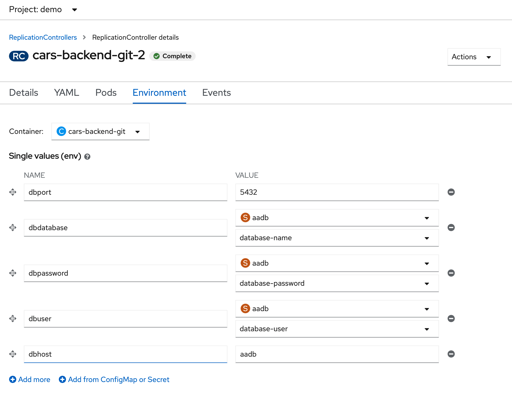

# cars-backend

**Log into OpenShift**
```bash
oc login -u developer -p developer

oc new-project aa-demo

oc get project
```

**Deploy a Database**
`oc new-app postgresql-persistent --name dbapp --param DATABASE_SERVICE_NAME=aadb --param POSTGRESQL_USER=developer --param POSTGRESQL_PASSWORD=developer --param POSTGRESQL_DATABASE=aadb`

Check out the Environment variables:

POSTGRESQL_USER
POSTGRESQL_PASSWORD
POSTGRESQL_DATABASE

`oc get pods`

Confirm that the database is running.

`oc get service`

Show that PostgreSQL is running on Port 5432.

`oc get route`

Open the Pod inside the Service, go to Terminal:
```bash
psql -U developer -d aadb 

CREATE TABLE cars (
	car_id serial PRIMARY KEY,
	brand VARCHAR ( 50 ) NOT NULL,
	make VARCHAR ( 50 ) NOT NULL,
	price VARCHAR ( 50 ) NOT NULL,
	image VARCHAR ( 500 ) NOT NULL
);

INSERT INTO cars (brand, make, price, image) VALUES ('Audi', 'A5', '55.000', 'https://motoringmatters.ie/wp-content/uploads/2019/09/audi-a5_03.jpg');

INSERT INTO cars (brand, make, price, image) VALUES ('BMW', '4 Series', '58.000', 'https://cdn1.buyacar.co.uk/sites/buyacar/files/bmw-4-series-1.jpg');

INSERT INTO cars (brand, make, price, image) VALUES ('Mercedes', 'C Class', '65.000', 'https://carwow-uk-wp-0.imgix.net/mercedes-c-class-revealed-front-1.jpg?auto=format&cs=tinysrgb&fit=clip&ixlib=rb-1.1.0&q=60&w=750');

INSERT INTO cars (brand, make, price, image) VALUES ('Porsche', '911', '150.000', 'https://cdn.motor1.com/images/mgl/nr6Jx/s1/porsche-911-carrera-992-2019.jpg');

SELECT * FROM cars;
```

---------------------------

**Deploy the Backend**

Open the Topolgy.

Right click -> Add Project -> From Git -> Insert Git Url from below ->  Proceed with defaults and deploy.

Git repository: `https://github.com/florianmoss/cars-backend`

Inspect the index.js and queries.js file.

No Dockerfile needed.

Select Topology and add the environment variables as seen below:



Open the application and make a request to /cars

---------------------------

**Deploy the Frontend**

Select Topology and deploy from Dockerfile, use the frontend repo: `https://github.com/florianmoss/cars-frontend.git`.


---------------------------

